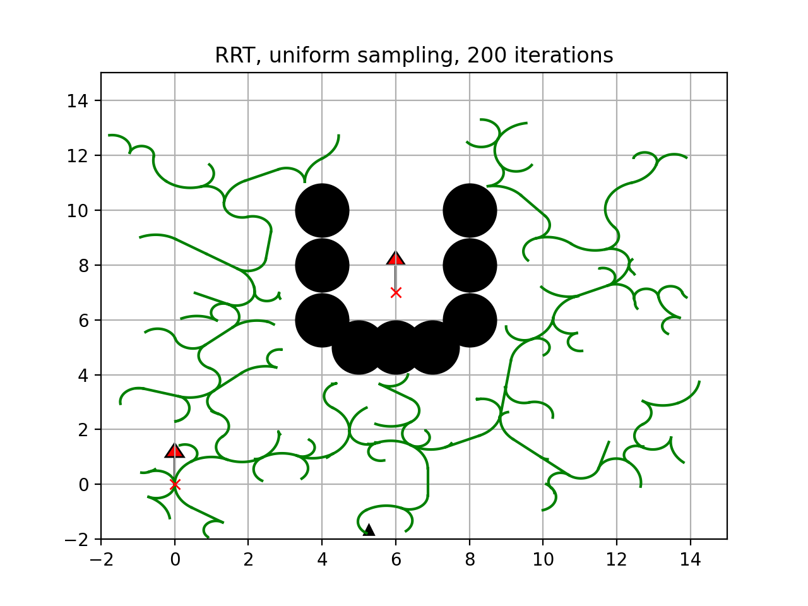
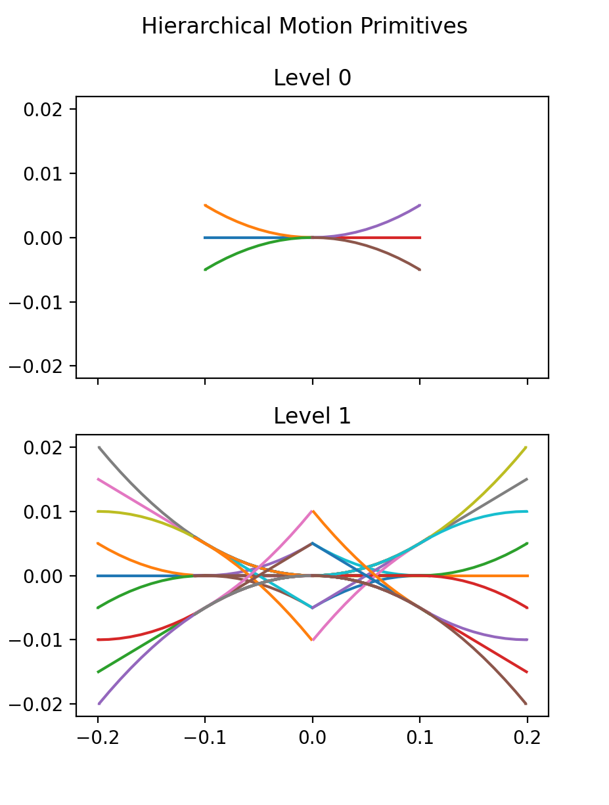

## Project Overview
 Our project is a survey of sample-based planning for non-holonomic systems. This website provides an overview of our work, along with more detailed experimentation results. 
 
### Abstract
We review a breadth of literature related to non-holonomic motion planning methods, then provide a deep analysis of current solutions to near-optimal sample-based planning with obstacles with the RRT* algorithm. We suggest a method for achieving the desirable properties of RRT* while achieving dynamical feasibility of generated paths in non-holonomic systems.

## Literature Review
Please refer to our full paper for more detail and references. 

## Experimentation and Results
To demonstrate potential advantages of different approaches to dynamically-feasible path planning around obstacles for non-holonomic systems, we implemented some of the algorithms we found during review and compared the results qualitatively. Our simulations were created by extending the RRT implementations within the Python Robotics package [1]. We planned for the unicycle model, chainging together dynamically feasible motion primitives to ensure dynamic feasiblity. 

We were especially interested in planners that can navigate around obstacles, so we chose two layouts to run our tests on.
1. Placing the goal within a U-shaped obstacle so that the agent needs to find the opening of the U
2. Positioning obstacles that require the agent to navigate through narrow openings to reach the goal

### Baseline Tests

We began with a basic implementation of RRT with motion primitives, uniformly sampling the space. 

#### Motion Primitives

#### Results

### Path-biased Sampling

Next, we turned to path-biased sampling approaches. These entail a two-step approach: first pre-generating a dynamically infeasible path and then running RRT, biasing samples towards points along the pre-generated path. Our implementation used vanilla RRT* to pre-generate a path, though any variant could be used for faster convergence. Then, we ran RRT with the same set of motion primitives, sampling randomly from the length of the pregenerated path. 

#### Step 1: RRT*

#### Step 2: Path-biased RRT

### Hierarchical Motion Primitives

Finally, we aimed to make improvements through the selection of motion primitives. Vukosavljev et al use a hierarchical framework for motion planning of multiple quadcoptors in a cluttered environment [2]. In an attempt to make our motion primitive set more robust, we start with a subset of our original set of motion primitives (Level 0) and concatenate them pairwise to form a Level 1 set. Then, we use the same two-step planning scheme as above, but select from all the Level 0 and Level 1 primitives.

#### Motion Primitives

#### Results

## Team Bios
### Rebecca Abraham
Rebecca is a 4th year undergraduate student at UC Berkeley studing Electrical Engineering & Computer Science. Rebecca is an undergraduate research fellow at the Berkeley Center for New Media.

### Evan Lohn
Evan is a 4th year undergaduate student at UC Berkeley studying Electrical Engineering & Computer Science. He is interested in machine learning. 

## References
[1] M. Vukosavljev, A. P. Schoellig, and M. E. Broucke, “Hierarchically consistent motion primitives for quadrotor coordination,” 2019.

[2] A. Sakai, D. Ingram, J. Dinius, K. Chawla, A. Raffin, and A. Paques,“Pythonrobotics:  a  python  code  collection  of  robotics  algorithms,”2018

